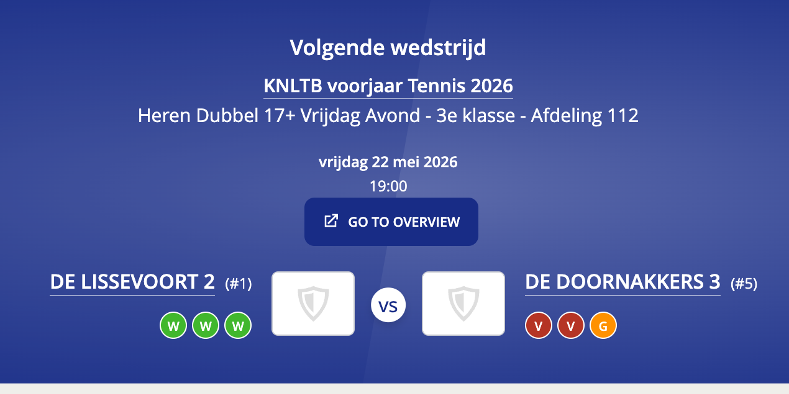
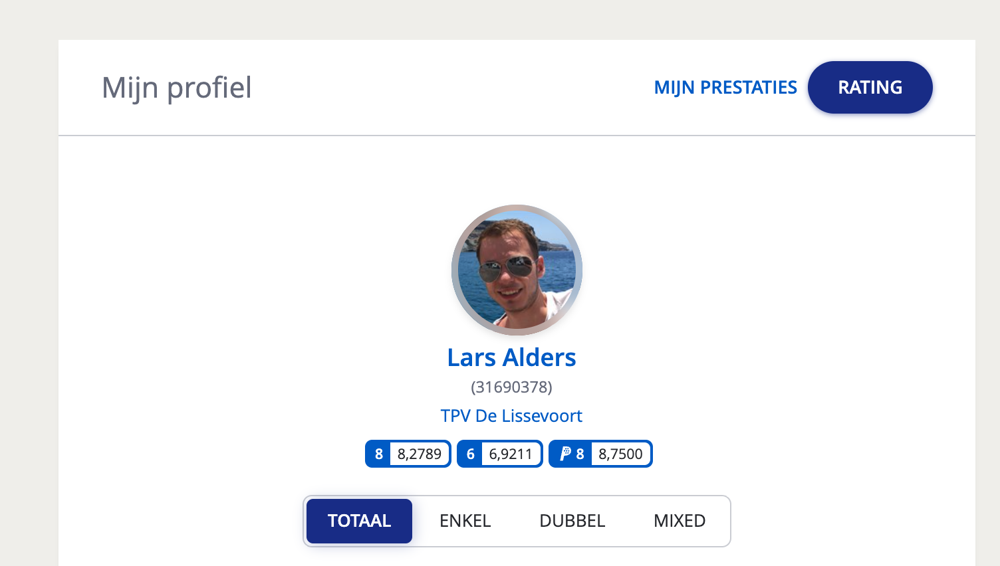

# KNLTB Tools

A Chrome extension that adds interactive rating tools to [MijnKNLTB](https://mijnknltb.toernooi.nl). Simulate rating changes, analyse match history, and navigate the site more efficiently.

## Table of contents

- [Features](#features)
- [Installation](#installation)
- [Project structure](#project-structure)
- [Rating model](#rating-model)

---

## Features

### Draw page — match rating simulator

Active on any tournament draw/group page with a player registration table. A floating, resizable panel appears with the following tools.


**Importing matches**

| Button | What it does |
|--------|--------------|
| **Show Matches** | Loads all matches from the current group draw page |
| **Find All** | Scans all similar categories across the tournament and collects matches from every group page |
| **Refresh Ratings** | Re-fetches the current rating for every player by visiting their profile pages |

All three show a live progress bar, e.g. `Processing player 3 of 14: Lars Alders (21%)`.

**Match table columns:** Date/Time · Team 1 & Team 2 with starting ratings · Avg team rating (doubles only) · Win % · Category (Find All only) · Result

**Selecting a winner:** Click a team name to mark them as the winner — the cell turns green, the loser red, and each player's name updates with their new rating:

```
Lars Alders (7.6971 → 7.7240) ▲0.0269
```

Click the winning team again to deselect and reset.

**Player Rating Summary:** Below the match table, a compact overview shows every player's starting rating, current simulated rating, and cumulative change across all entered results.

**Manual controls:**
- **Player dropdown + Add Match** — manually add a match between any two players or pairs in the draw
- **Set Rating** — override a player's starting rating when the listed value is outdated

---

### Main page — navigation shortcuts

- **Go to overview** buttons are injected next to each scheduled category (e.g. *Tennis HE6 - Groep A*), linking directly to that category's event overview
  
- A **Go to overview** button is added to the "Volgende wedstrijd" banner
  
- A **Rating** button is added next to "Mijn prestaties", jumping straight to your rating history page
  

---

### Player profile — rating chart

Active on `mijnknltb.toernooi.nl/player-profile/*/Rating`.

An interactive chart of your rating over time, split by category: **Singles** (blue) · **Doubles** (green) · **Padel** (orange). Each series includes a dashed linear regression trend line.

Hover over a data point for full match details: date, tournament/round, opponent names, set scores, and rating impact. Click a legend item to toggle a category; the Y-axis rescales automatically.

---

## Installation

1. Clone or download this repository.
2. Open Chrome and go to `chrome://extensions`.
3. Enable **Developer mode** (top-right toggle).
4. Click **Load unpacked** and select the repository folder.

The extension activates automatically on `mijnknltb.toernooi.nl`.

---

## Project structure

```
manifest.json              Chrome extension manifest (MV3)
icon.png                   Extension icon
pages/
  draw.js                  Entry point for draw/group pages
  draw-import.js           Match and player data fetching
  draw-parser.js           HTML parsing for draw data
  draw-state.js            Rating simulation state
  draw-ui.js               Draw panel UI rendering
  player-profile.js        Player profile page (rating chart)
shared/
  knltb-utils.js           Shared utilities (name normalisation, rating helpers, date parsing)
  ui-panel.js              Shared floating panel / button components
lib/
  chart.min.js             Chart.js (bundled)
  chartjs-adapter-date-fns.bundle.min.js
```

---

## Rating model

The extension uses a logistic model consistent with the KNLTB DSS system:

```
K        = 0.275
q        = 2.012
expected = 1 / (1 + exp(q × (ratingTeam1 − ratingTeam2)))
change   = K × (expected − 1)   // winner; loser gets the inverse
```

For doubles, both team members receive the same rating change. Changes are computed sequentially in chronological order, so later matches reflect updated ratings from earlier ones.
