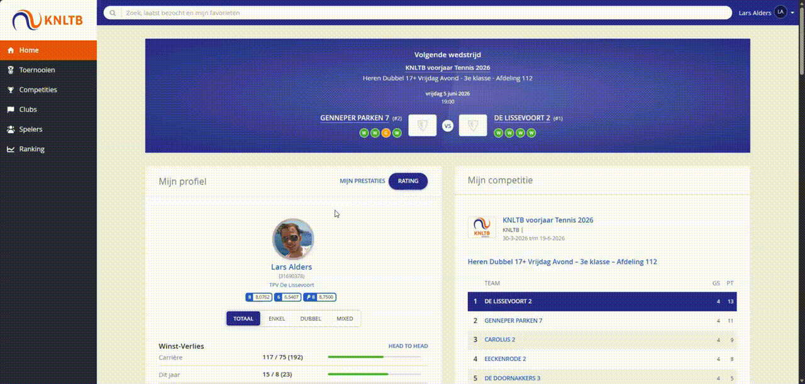
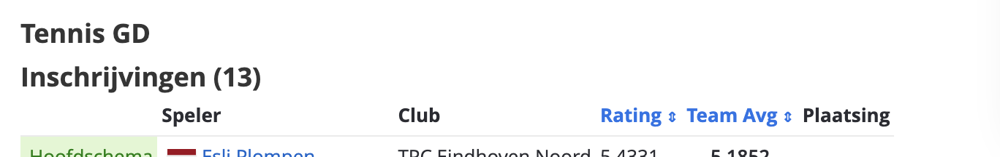
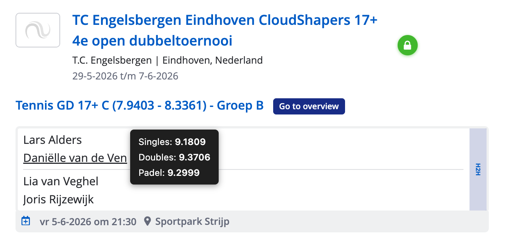
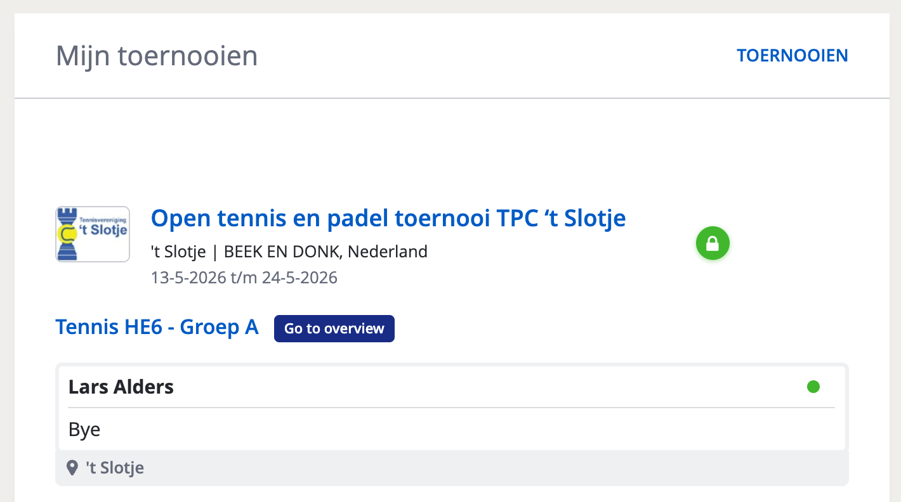
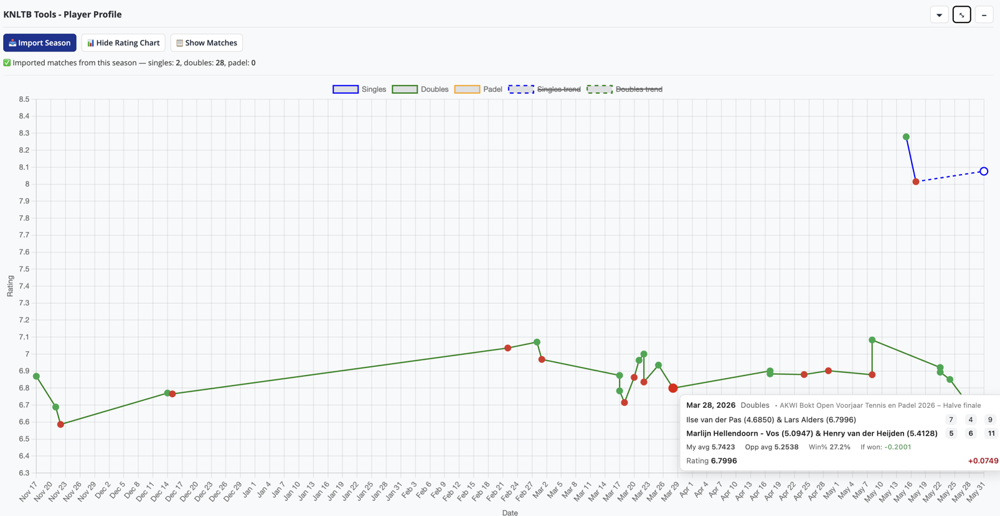
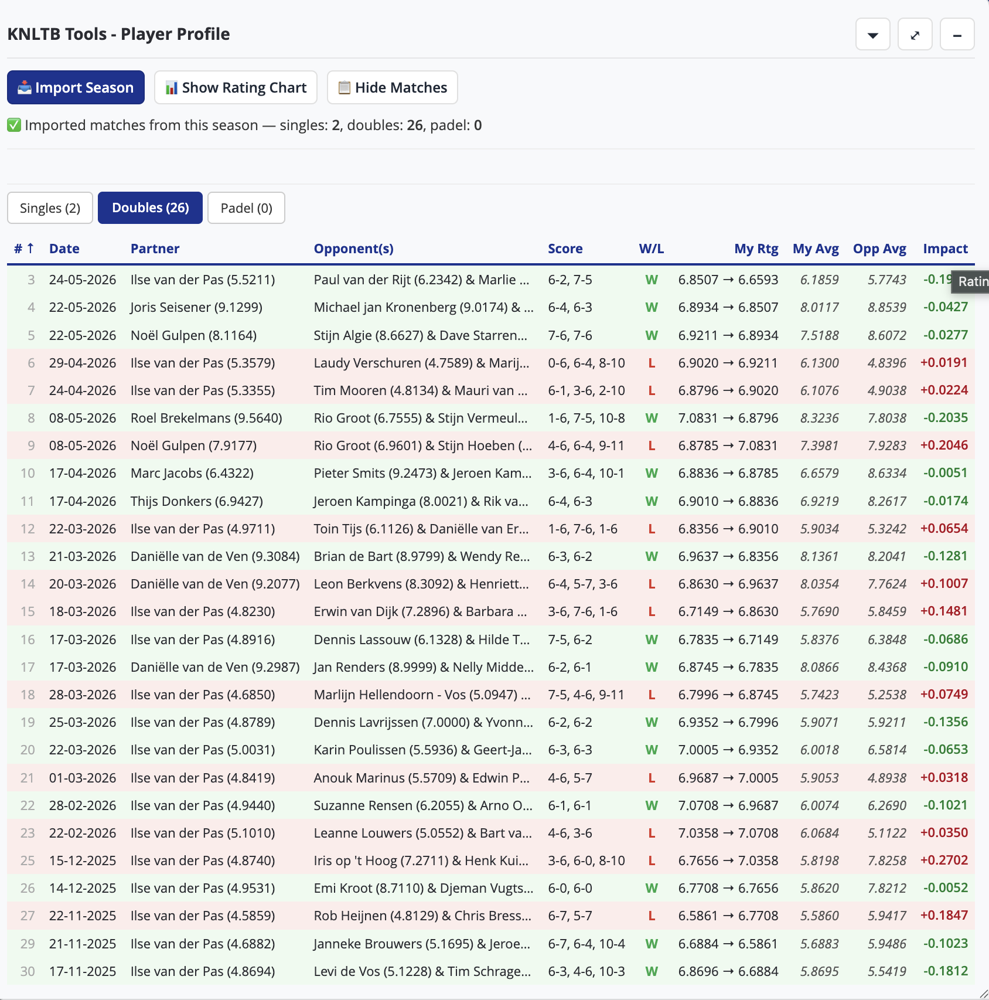
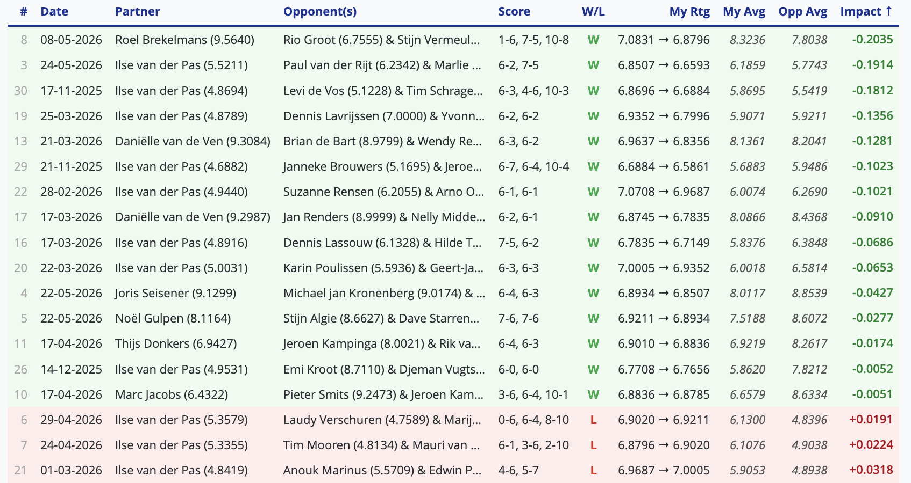
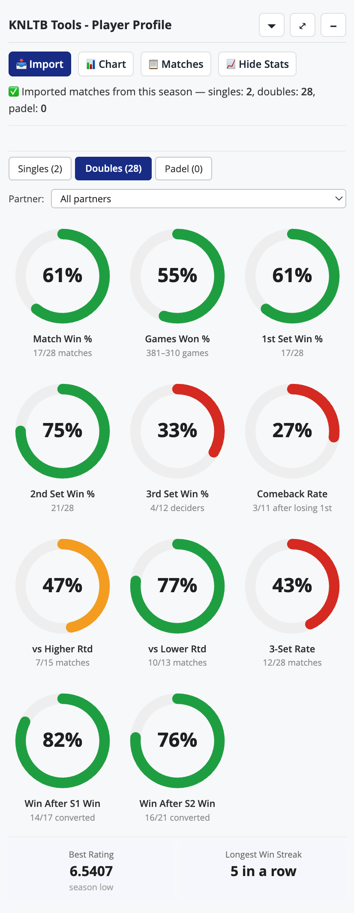

# KNLTB Tools

A browser extension that adds interactive rating tools to [MijnKNLTB](https://mijnknltb.toernooi.nl) — simulate rating changes, analyse match history, and navigate the site more efficiently.

> **A note on AI** — This project was built with the help of AI (Claude). I work in IT and understand how software works, but I am not a developer by profession — and without AI assistance I simply would not have been able to build this. I think that's worth being transparent about.

---



---

## Table of contents

- [Roadmap](#roadmap)
- [Features at a glance](#features-at-a-glance)
- [Draw page — match rating simulator](#draw-page--match-rating-simulator)
- [Category page — sortable player table](#category-page--sortable-player-table)
- [All pages — player rating tooltips](#all-pages--player-rating-tooltips)
- [Home page — navigation shortcuts](#home-page--navigation-shortcuts)
- [Player profile — rating chart & match history](#player-profile--rating-chart--match-history)
- [Installation](#installation)
- [Project structure](#project-structure)
- [Rating model](#rating-model)

---

## Roadmap

| Feature | Status | Notes |
|---------|--------|-------|
| **Padel rating prediction** | Planned | The padel rating calculation changed on 1 January 2025; the current simulator uses the tennis model. This feature will implement the new padel-specific formula so predictions are accurate for padel matches. |
| **Apple App Store release** | On hold | The extension works on iPhone and is shelf-ready, but publishing requires an Apple Developer subscription ($100/year). Not currently worth the investment, so this is parked for now. |

---

## Features at a glance

| Page | What's added |
|------|-------------|
| **Draw / group page** | Floating panel: match importer, win % calculator, rating simulator, manual adjustments |
| **Category page** | Player registration table sortable by individual rating and team average rating |
| **Home page** | *Go to overview* shortcuts on categories and the next-match banner; *Rating* shortcut button |
| **All pages** | Hover any player name link to see their singles, doubles, and padel ratings in a tooltip |
| **Player profile** | Interactive rating history chart with trend lines, a sortable match history table, and a season stats panel with 11 performance metrics |

---

## Draw page — match rating simulator

Active on any tournament draw or group page that has a player registration table. A floating, resizable panel appears automatically.


### Importing matches

| Button | What it does |
|--------|--------------|
| **Show Matches** | Loads all matches from the current draw / group page |
| **Find All** | Scans every player's profile to discover similar categories across all tournaments, then collects matches from each group page found |
| **Refresh Ratings** | Re-fetches each player's current rating from their profile page |

All three operations show a live progress indicator, e.g. `Processing player 3 of 14: Lars Alders (21%)`.

### Match table

Columns: **Date/Time** · **Team 1 & 2** with starting ratings · **Avg rating** (doubles) · **Win %** · **Category** (Find All only) · **Result**

**Selecting a winner:** Click a team name to mark them as the winner — that cell turns green, the other red, and each player's name updates with their new simulated rating:

```
Lars Alders (7.6971 → 7.7240) ▲0.0269
```

Click the winning team again to deselect and reset.

### Player Rating Summary

Below the match table, a compact overview shows every player's starting rating, current simulated rating, and cumulative change across all entered results.

### Manual controls

- **Add Match** — manually add a match between any two players or pairs in the draw
- **Set Rating** — override a player's starting rating when the listed value is outdated

### Panel shortcuts

| Key | Action |
|-----|--------|
| `Esc` | Minimise / restore the panel to the dock |

---

## Category page — sortable player table

Active on any category page that lists registered players (*Onderdelen* / *Schema's* tab). The player registration table gets sortable column headers: click **Rating** to rank players by their individual rating, or **Team avg** to rank doubles pairs by their combined average. Useful before a tournament starts, when the default order is not sorted by rating.



---

## All pages — player rating tooltips



Hover over any player name that links to a profile page to see their current singles, doubles, and padel ratings in a tooltip. Works on match listings, the home page, draw pages — anywhere on `mijnknltb.toernooi.nl`. Ratings are fetched on first hover and cached for the rest of the session.

---

## Home page — navigation shortcuts

 

- **Go to overview** buttons appear next to each scheduled category (e.g. *Tennis HE6 - Groep A*), linking directly to that category's event overview page
- A **Go to overview** button is added to the *Volgende wedstrijd* (next match) banner


- A **Rating** button is added next to *Mijn prestaties* on the player profile page, jumping straight to your rating history

---

## Player profile — rating chart & match history

Active on `mijnknltb.toernooi.nl/player-profile/*/Rating`.

### Rating chart



An interactive chart of your rating over time, split by category: **Singles** (blue) · **Doubles** (green) · **Padel** (orange). Each series includes a dashed linear-regression trend line (hidden by default — click the legend to enable). Manual rating adjustments are marked directly on the chart.

Hover over any data point for full match details: date, tournament/round, opponent names, set scores, and rating impact. Click a legend item to toggle a category on/off; the Y-axis rescales automatically.

### Match history table

 

A sortable table of all imported matches per category (Singles / Doubles / Padel). Click any column header to sort — the **Impact** column is particularly useful for spotting your best and worst results at a glance. Row colours indicate win (green) or loss (red).

### Season stats



A panel of 11 donut charts giving a quick visual read of your season. Open it with the **📈 Stats** button; the panel expands to fill the screen when maximised.

| Metric | Description |
|--------|-------------|
| **Match Win %** | Overall win rate |
| **Games Won %** | Games won across all sets |
| **1st / 2nd / 3rd Set Win %** | Win rate per set |
| **Win After S1/S2 Win** | Match conversion rate after winning that set |
| **Comeback Rate** | Win rate in matches where you lost the first set |
| **vs Higher / Lower Rated** | Win rate against opponents rated above or below you |
| **3-Set Rate** | Share of matches that went to a deciding set |

Colour coding: **green** ≥ 55 % · **orange** 45–54 % · **red** < 45 %. Switch between Singles, Doubles, and Padel with the tabs; Doubles adds a partner filter.

---

## Installation

### Chrome Web Store (recommended)

Install directly from the [Chrome Web Store](https://chromewebstore.google.com/detail/knltb-tools/emmhdkcchcmgbpflohecdllhollepalh) — no developer mode required.

### Manual (developer)

1. Clone or download this repository.
2. Open Chrome and go to `chrome://extensions`.
3. Enable **Developer mode** (top-right toggle).
4. Click **Load unpacked** and select the repository folder.

The extension activates automatically on `mijnknltb.toernooi.nl`.

---

## Project structure

```
manifest.json              Chrome extension manifest (MV3)
icon.png                   Extension icon
assets/                    Screenshots used in this README
pages/
  draw.js                  Entry point for draw / group pages
  draw-import.js           Match and player data fetching
  draw-parser.js           HTML parsing for draw data
  draw-state.js            Rating simulation state
  draw-ui.js               Draw panel UI rendering
  player-profile.js        Player profile page (rating chart, match table, season stats)
  rating-tooltips.js       Player rating tooltips injected on all pages
shared/
  knltb-utils.js           Shared utilities (name normalisation, rating helpers, date parsing)
  ui-panel.js              Shared floating panel / button components
lib/
  chart.min.js             Chart.js (bundled)
  chartjs-adapter-date-fns.bundle.min.js
```

---

## Rating model

The extension uses the logistic model from the KNLTB DSS system:

```
K        = 0.275
q        = 2.012
expected = 1 / (1 + exp(q × (ratingTeam1 − ratingTeam2)))
change   = K × (expected − 1)   // winner; loser gets the inverse
```

For doubles, both team members receive the same rating change. Changes are applied sequentially in chronological order, so each match reflects ratings updated by all prior results.
