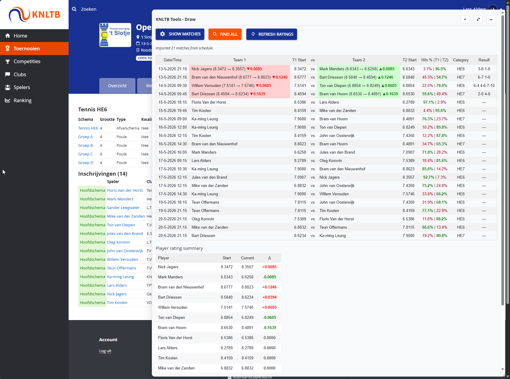
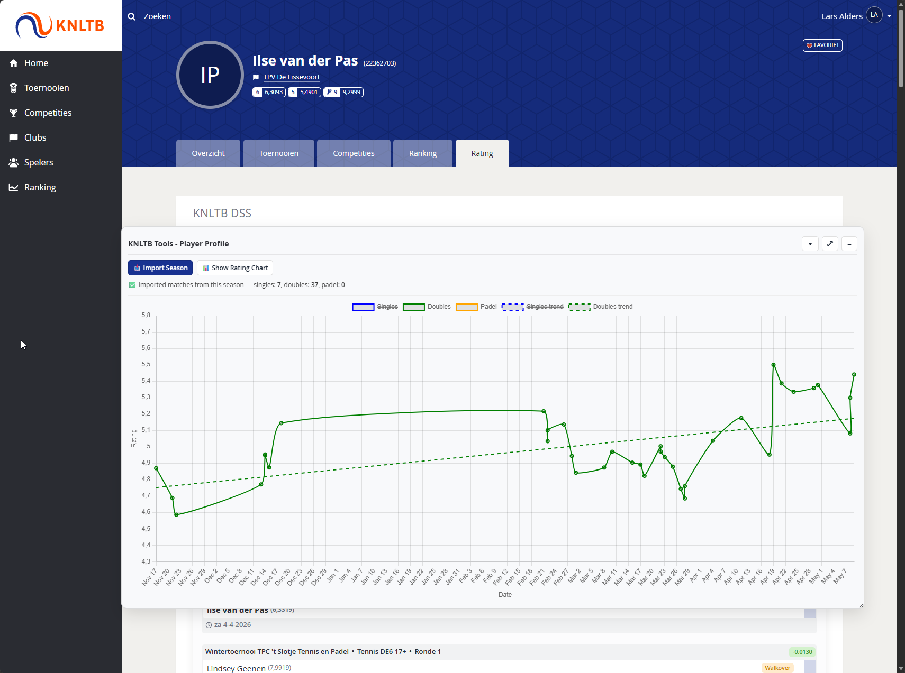

# KNLTB Tools

A Chrome extension that adds interactive rating tools to [MijnKNLTB](https://mijnknltb.toernooi.nl), the KNLTB tournament platform. It helps you simulate rating changes, analyse match history, and navigate the site more efficiently.

---

## Table of contents

- [Features](#features)
  - [Draw page — match rating simulator](#draw-page--match-rating-simulator)
  - [Main page — navigation shortcuts](#main-page--navigation-shortcuts)
  - [Player profile — rating chart](#player-profile--rating-chart)
- [Installation](#installation)
- [Project structure](#project-structure)
- [Rating model](#rating-model)

---

## Features

### Draw page — match rating simulator

Activated on any tournament draw/group page that contains a player registration table.





A floating, resizable panel appears with the following functionality:

#### Importing matches

| Button | What it does |
|--------|--------------|
| **Show Matches** | Loads all matches from the current group draw page |
| **Find All** | Scans all similar categories across the tournament (e.g. all singles categories) and collects matches from every group page |
| **Refresh Ratings** | Re-fetches the current rating for every player by visiting their profile pages |

All three operations show a live progress bar: `Processing player 3 of 14: Lars Alders (21%)`.

#### Match table

Each imported match shows:

- **Date / Time**
- **Team 1** and **Team 2** names with their individual starting ratings
- **Avg** — team average rating (hidden for singles)
- **Win %** — expected win probability for each side based on the logistic rating model
- **Category** — which category the match came from (only shown when using Find All)
- **Result** — set scores or special flags (Walkover / Opgave)

#### Selecting a winner

Click a team name cell to mark that team as the winner. The winner cell turns green and the loser cell turns red. Each player's name is replaced with:

```
Lars Alders (7.6971 → 7.7240) ▲0.0269
```

Click the winning team again to deselect and reset.

#### Player Rating Summary

Below the match table, a compact summary shows every player's starting rating, current (simulated) rating, and the cumulative change across all entered results.

#### Manual controls

- **Player dropdown + Add Match** — manually add a match between any two players or pairs already in the draw
- **Set Rating** — override a player's starting rating (useful when the listed rating is outdated)

---

### Main page — navigation shortcuts

#### Scheduled category buttons

When matches are scheduled for one or more categories on your main page (e.g. *Tennis HE6 - Groep A*, *Tennis GD5*), a blue **Go to overview** button is injected next to each category name. Clicking it navigates directly to that category's event overview page.

#### Upcoming match banner

A **Go to overview** button is added to the "Volgende wedstrijd" banner so you can jump to the event overview from the main player page without digging through menus.

#### Rating shortcut

A **Rating** button is added next to the "Mijn prestaties" link, taking you directly to your rating history page.

---

### Player profile — rating chart

Activated on `mijnknltb.toernooi.nl/player-profile/*/Rating`.

A floating panel renders an interactive chart of your rating over time, split by category:

- **Singles** (blue)
- **Doubles** (green)
- **Padel** (orange)

Each series includes a **dashed trend line** computed via linear regression.

**Hover tooltips** show full match details for each data point:

- Date and tournament/round
- Opponent names and set scores
- Rating value and impact (`+0.0269`)

Click a legend item to toggle a category on/off; the Y-axis rescales automatically to the visible data.

---

## Installation

1. Clone or download this repository.
2. Open Chrome and go to `chrome://extensions`.
3. Enable **Developer mode** (top-right toggle).
4. Click **Load unpacked** and select the repository folder.

The extension activates automatically on `mijnknltb.toernooi.nl`.

---

## Project structure

```
manifest.json              Chrome extension manifest (MV3)
icon.png                   Extension icon
pages/
  draw.js                  Draw / group page logic (match simulator)
  player-profile.js        Player profile page logic (rating chart)
shared/
  knltb-utils.js           Shared utilities (name normalisation, rating helpers, date parsing)
  ui-panel.js              Shared floating panel / button components
lib/
  chart.min.js             Chart.js (bundled)
  chartjs-adapter-date-fns.bundle.min.js
```

---

## Rating model

The extension uses a logistic rating model consistent with the KNLTB DSS system:

```
K  = 0.275
q  = 2.012
expected = 1 / (1 + exp(q × (avgTeam1 − avgTeam2)))
change   = K × (expected − 1)          // applied to winner
```

For doubles, both team members receive the same rating change. Rating changes are computed sequentially in chronological match order, so later matches in the table reflect the updated ratings from earlier ones.
